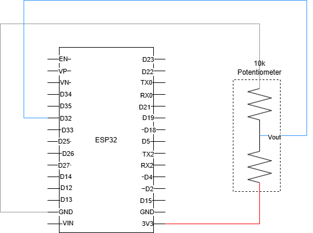
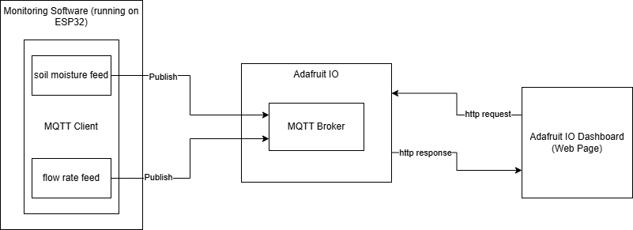

# IoT-prj-NFT
## Installation and Setup
### Installing the NFT Monitoring software on ESP32 using the Thonny IDE:
The software can be installed on an ESP32 using the Thonny IDE. Save the main.py file to the device. For more information on setting up Thonny go [here](https://randomnerdtutorials.com/getting-started-thonny-micropython-python-ide-esp32-esp8266/).
### Connect to your router:
At the top of the main.py file there are two variables called ‘ssid’ and ‘password’. Replace the “your wifi” and “your password” fields with your wifi name and password. You can run the program at this point to test the connection.
### Accessing the Dashboard:
The Adafruit IO dashboard can be accessed via this link: (https://io.adafruit.com/lucindahogue1/dashboards/nft-hydroponics-dashboard)

## Wiring Diagram

## Software Architecture

